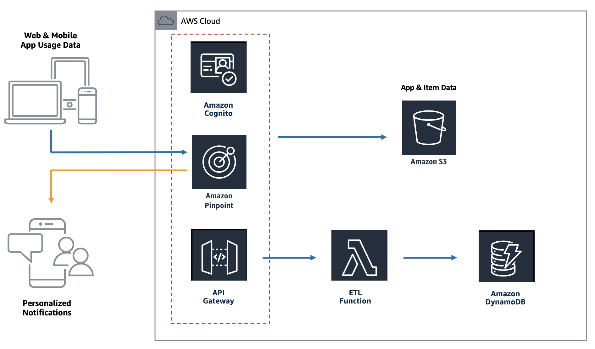

# Full Serverless App with React and Amplify

본 레포지터리의 내용은 [AWS Amplify Workshop](https://master.d3f5073vvso9t3.amplifyapp.com) 실습 결과물 입니다.  
AWS Cloud9 환경에서 작업했기 때문에, Local 환경에서는 동작하지 않을 수 있습니다.



```bash
.
├── amplify
│   └── backend
│       ├── analytics
│       │   └── amplifyworkshop      : Pinpoint - 사용자 이벤트 수집 (커스텀 속성 추가)
│       ├── api
│       │   └── amplifyworkshopapi   : API Gateway - 프론트엔드에 REST API 호스팅
│       ├── auth
│       │   └── EcommerceAuth         : Cognito - 사용자 등록과 인증 처리
│       ├── function
│       │   └── AmplifyWorkshopLambda : Lambda - 상품 정보 조회
│       │       └── src              
│       └── storage
│           └── dynamodbitems         : DynamoDB - 상품 정보 저장
├── public
│   └── images
│       ├── misc
│       ├── products
│       └── slider
└── src
    ├── components
    ├── config
    ├── context
    └── pages
```